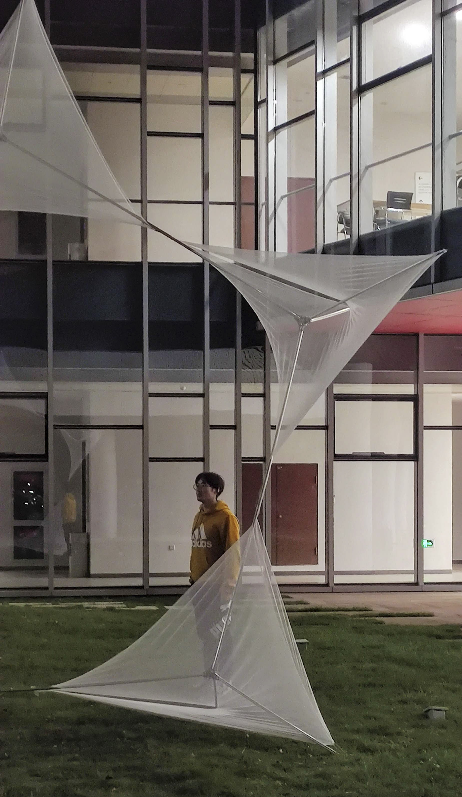

# The Public Architecture And Design Research Institute 

[Wenzhou-Kean University](https://wku.edu.cn/)

# [PLEASE VOTE for the best reseach project for the 2021 Conference and Exhibition](https://forms.gle/sGX9KmJ9wogKmYhB8) 

<iframe src="https://docs.google.com/forms/d/e/1FAIpQLSergCIOCb4lWIYbU6hJbtrDANB9iY6nzsFVAX313fntSgysqw/viewform?embedded=true" width="640" height="1817" frameborder="0" marginheight="0" marginwidth="0">Loading…</iframe>

***PADRI was organized to support the research initiatives of Wenzhou-Kean University (WKU), Michael Graves College (MGC) faculty and students.
It operates under the directive of making place ideal for humanity through research and technology. The Research Institute is currently working on local applied research projects in Zhejiang, China, as well as international research projects and competitions. The Michael Graves Collage wide Designing Public Spaces (DPS) research initiative is a main foci of our research agenda. For example the Wenruitang River Project (Sustainable development of vernacular historical districts in Wenzhou Area) is an ambitious and substantial part of DPS.

The Wenruitang River Project is a great example of the opportunities for young design students to engaging the community, and practice design methodology, in controlled yet real world scenarios, providing rapid feedback. This  gives students the opportunity to learn in a very exciting, yet productive way. This is made possible through a focus on reinvigorating historic infrastructure, partnering with municipalities and key decision makers to propose innovative methods and interventions based on research and evaluation of existing conditions.

There are numerous other funded research projects.*

The theme is available as open source under the terms of the [MIT License](http://opensource.org/licenses/MIT).
